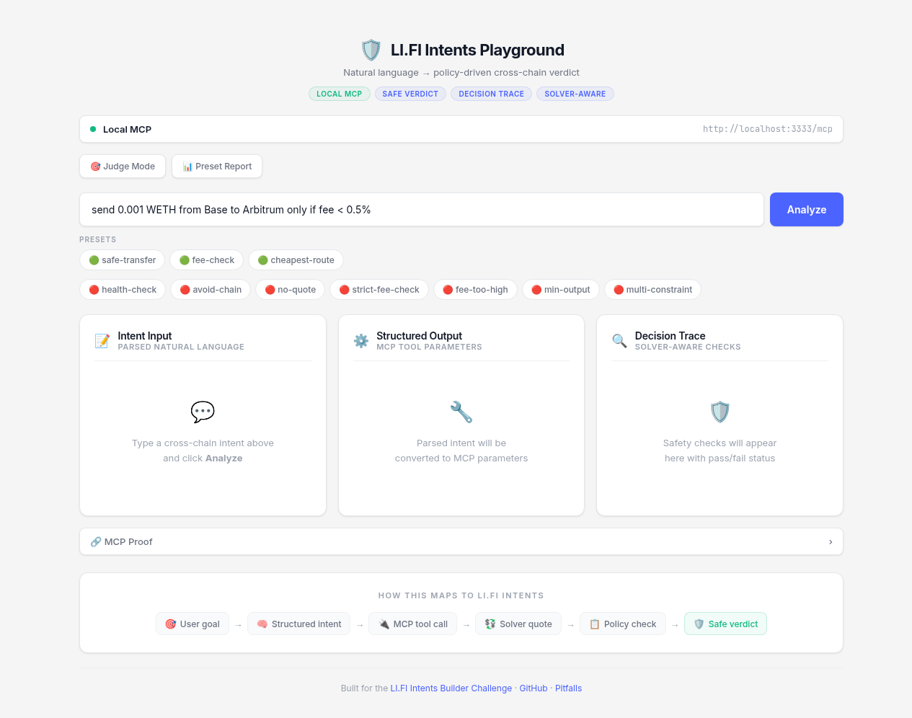
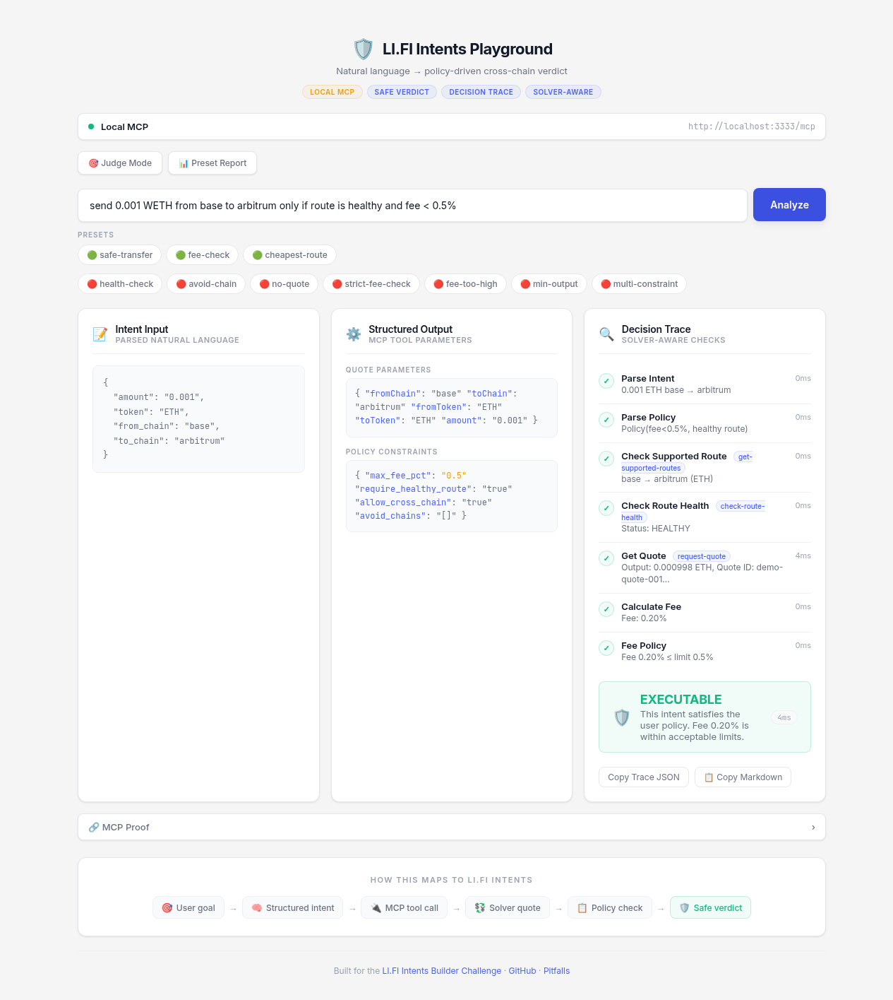
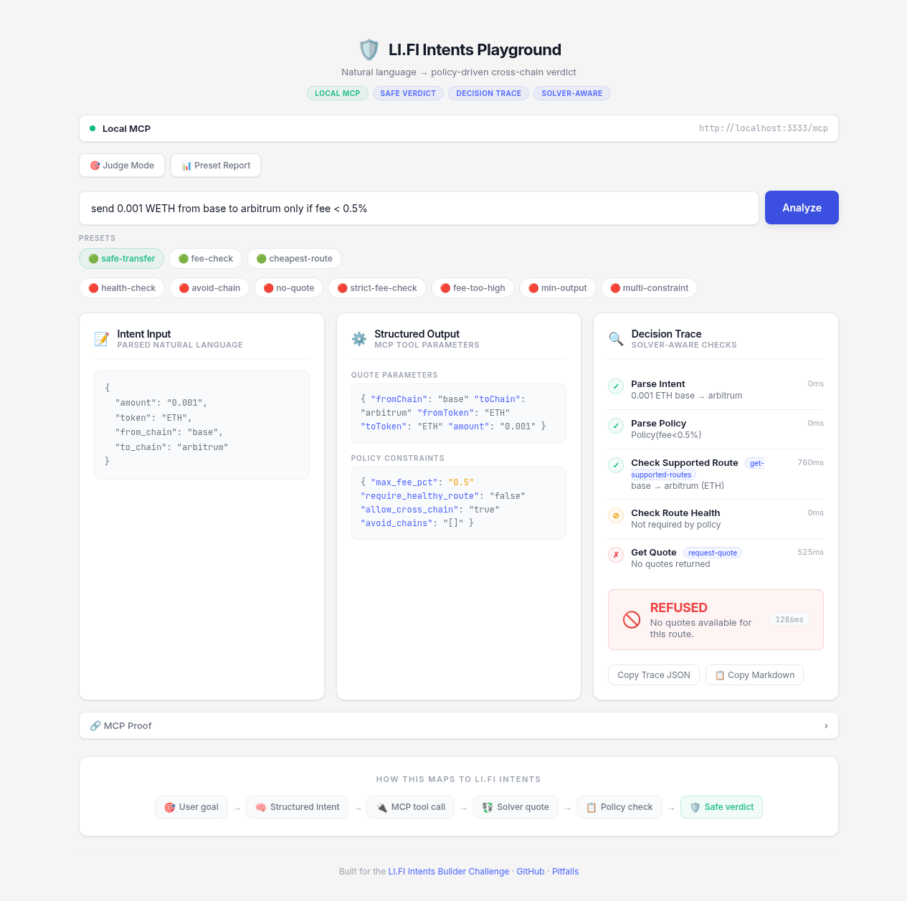
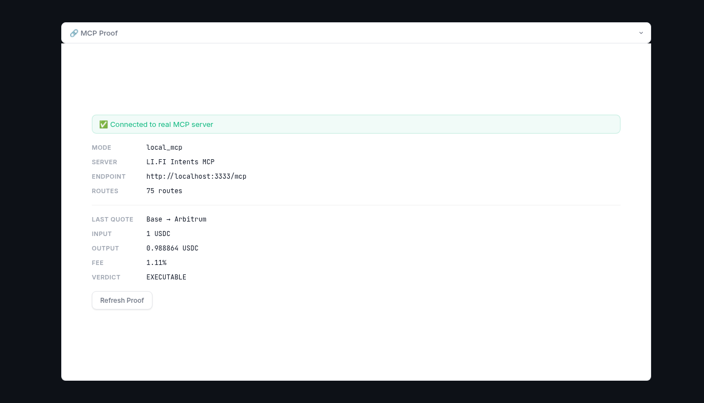
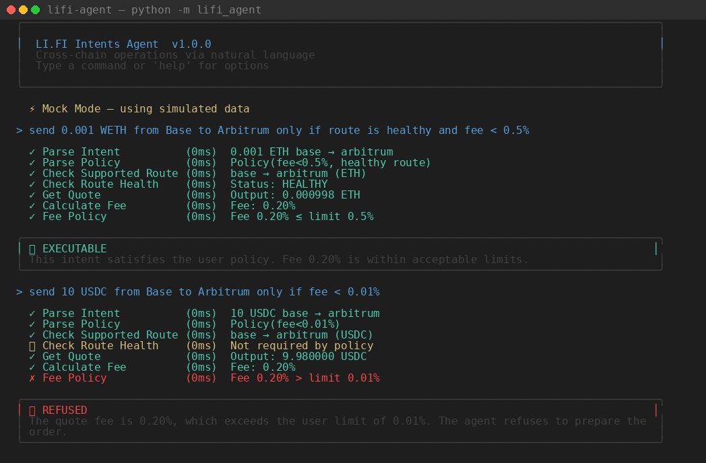

# LI.FI Intents × AI Agent — Safe Verdict Playground

> Policy-driven cross-chain decisions for AI Agents.
> Natural language in → EXECUTABLE or REFUSED verdict out, with full decision traces.

**🔗 Live demo → [lifi.degure.me](https://lifi.degure.me)** · **📦 Source → [GitHub](https://github.com/tiyadegure/lifi-intents-demo)**

Built for the [LI.FI Intents Mini Builder Challenge](https://lifi.notion.site/LI-FI-Intents-Mini-Builder-Challenge-366f0ff14ac78168a0cdd9f44a3c1f13).

---

## What it does

Type a cross-chain intent in natural language with safety constraints:

```
send 0.001 WETH from Base to Arbitrum only if route is healthy and fee < 0.5%
```

The system runs a **Safe Verdict Pipeline**:

1. **Parse Intent** — extract amount, token, source/destination chains
2. **Parse Policy** — extract constraints: max fee, route health, chain filters, min output
3. **Check Supported Route** — call `get-supported-routes` via MCP
4. **Check Route Health** — call `check-route-health` (if policy requires it)
5. **Request Quote** — call `request-quote` for real-time solver pricing
6. **Calculate Fee** — compute actual fee percentage from input/output
7. **Evaluate Policy** — compare against all constraints
8. **Return Verdict** — ✅ EXECUTABLE or 🚫 REFUSED with detailed reasoning

Every step is logged in a **Decision Trace** with MCP tool names, input/output, timing, and reasoning.

---

## Screenshots

### Web Interface — Homepage


Three-column layout: **Intent Input** (parsed natural language) → **Structured Output** (MCP parameters) → **Decision Trace** (solver-aware checks with timing).

### Decision Trace — EXECUTABLE ✅


All checks passed: route supported, route healthy, fee 0.20% within 0.5% limit. Verdict: **EXECUTABLE**.

### Decision Trace — REFUSED 🚫


Policy violation detected: fee too high or route unavailable. Verdict: **REFUSED** with detailed reasoning.

### MCP Proof — Real Server Connection


Live verification panel: connected to real MCP server, 75 routes available, latest quote with fee and verdict.

### CLI — Interactive Terminal


Rich-formatted terminal with colored output: green ✓ for passed checks, red ✗ for policy violations, verdict panels with reasoning.

---

## Features

| Feature | Description |
|---------|-------------|
| 🛡️ **Safe Verdict** | Policy-driven EXECUTABLE / REFUSED decisions with step-by-step reasoning |
| 📊 **Decision Trace** | Full audit log — every MCP call shows Purpose, Input, Output, Why |
| 🔌 **MCP Integration** | Real connection to LI.FI Intents MCP server (75 cross-chain routes) |
| 🔍 **MCP Call Inspector** | Each trace step expands to show raw MCP tool call details |
| 🎯 **10 Policy Presets** | One-click scenarios: safe-transfer, fee-check, avoid-chain, health-check, etc. |
| 🧑‍⚖️ **Judge Mode** | Run 5 key presets and compare expected vs actual verdicts |
| 📋 **Preset Report** | Batch test all 10 presets with pass/fail summary |
| 🌐 **Web UI** | Three-column layout with live analysis and real-time verdicts |
| 💻 **CLI** | Interactive terminal with Rich formatting and colored output |
| 🔍 **MCP Proof** | Live verification panel proving real server connection |
| 🩺 **Doctor** | Diagnostic checks for MCP connectivity, routes, and solver health |
| ⚖️ **Quote Compare** | Compare quotes across multiple destination chains |
| 🧪 **366 Tests** | Full coverage: parser, policies, verdicts, API endpoints, edge cases |

---

## 10 Policy Presets

Test different scenarios with one click:

| Preset | Intent | Expected |
|--------|--------|----------|
| 🟢 `safe-transfer` | 0.001 WETH Base→Arbitrum, fee<0.5% | EXECUTABLE |
| 🟢 `fee-check` | 0.001 WETH Base→Arbitrum, fee<0.3% | EXECUTABLE |
| 🟢 `cheapest-route` | 0.001 WETH Base→Arbitrum, prefer cheapest, fee<1% | EXECUTABLE |
| 🔴 `health-check` | 0.001 WETH Base→Arbitrum, healthy route required | REFUSED |
| 🔴 `avoid-chain` | 0.001 WETH Base→Arbitrum, avoid Arbitrum | REFUSED |
| 🔴 `no-quote` | 5 USDC Base→zkSync, no quote available | REFUSED |
| 🔴 `strict-fee-check` | 0.001 WETH Base→Arbitrum, fee<0.1% | REFUSED |
| 🔴 `fee-too-high` | 0.001 WETH Base→Arbitrum, fee<0.01% | REFUSED |
| 🔴 `min-output` | 0.001 WETH Base→Arbitrum, min 9999 output | REFUSED |
| 🔴 `multi-constraint` | 0.001 WETH Base→Arbitrum, fee<0.5% + avoid eth/poly + min 9999 | REFUSED |

**Judge Mode** runs 5 key presets and shows expected vs actual — instant confidence that the verdict engine is working correctly.

---

## Architecture

```
┌─────────────┐     ┌─────────────┐     ┌─────────────────┐     ┌──────────────┐
│  User Goal  │ ──→ │  AI Agent   │ ──→ │   MCP Server    │ ──→ │   Solver     │
│  (natural   │     │  (parse +   │     │  (LI.FI Intents │     │   Network    │
│  language)  │     │   policy)   │     │   API)          │     │  (compete)   │
└─────────────┘     └─────────────┘     └─────────────────┘     └──────────────┘
                                                                       │
                                                                       ↓
                                                              ┌──────────────┐
                                                              │ Safe Verdict │
                                                              │ EXECUTABLE   │
                                                              │ or REFUSED   │
                                                              └──────────────┘
```

### MCP Tools Used

| Tool | Purpose |
|------|---------|
| `get-supported-routes` | Discover available cross-chain routes |
| `check-route-health` | Verify solver coverage and recent order activity |
| `request-quote` | Get real-time solver quotes with pricing |
| `prepare-order` | Build order structure for execution |
| `track-order` | Monitor order status |
| `get-solver-identities` | List registered solver wallets |
| `get-quote-inventory` | View standing quotes for a route |

### Three MCP Modes

| Mode | Env Var | Description |
|------|---------|-------------|
| **Local MCP** | *(default)* | Connect to local MCP server, real solver data |
| **Mock Fallback** | auto | Falls back to mock if MCP unavailable |
| **Mock Forced** | `LIFI_AGENT_MOCK_MODE=1` | Always use mock data |
| **Strict** | `LIFI_AGENT_STRICT_MODE=1` | Require real MCP, no fallback |

---

## Example Output

### EXECUTABLE ✅

```
Input: send 0.001 WETH from Base to Arbitrum only if route is healthy and fee < 0.5%

Decision Trace:
  ✓ Parse Intent (0ms)     → 0.001 ETH base → arbitrum
  ✓ Parse Policy (0ms)     → Policy(fee<0.5%, healthy route)
  ✓ Check Route (0ms)      → base → arbitrum (ETH) supported
  ✓ Route Health (0ms)     → Status: HEALTHY
  ✓ Get Quote (4ms)        → Output: 0.000998 ETH
  ✓ Calculate Fee (0ms)    → Fee: 0.20%
  ✓ Fee Policy (0ms)       → Fee 0.20% ≤ limit 0.5%

Verdict: ✅ EXECUTABLE
Reason: This intent satisfies the user policy. Fee 0.20% is within acceptable limits.
```

### REFUSED 🚫

```
Input: send 10 USDC from Base to Tron only if fee < 0.5%

Decision Trace:
  ✓ Parse Intent (0ms)     → 10 USDC base → tron
  ✓ Parse Policy (0ms)     → Policy(fee<0.5%)
  ✗ Check Route (0ms)      → base → tron (USDC) not supported
  ✗ Route Health (0ms)     → No active solvers for Base→Tron
  ✗ Get Quote (0ms)        → No solver coverage

Verdict: 🚫 REFUSED
Reason: No solver coverage for Base→Tron. Policy violations detected.
```

---

## Quick Start

### Prerequisites
- Python 3.10+

### Install

```bash
git clone https://github.com/tiyadegure/lifi-intents-demo.git
cd lifi-intents-demo
pip install -e .
```

### Run CLI

```bash
python -m lifi_agent
# or
lifi-agent
```

### Run Web UI

```bash
pip install -e ".[web]"
uvicorn lifi_agent.server:app --port 8888
# Open http://localhost:8888
```

### Run Tests

```bash
pytest tests/ -v
# 366 tests, all passing
```

### Environment Variables

| Variable | Default | Description |
|----------|---------|-------------|
| `LIFI_MCP_URL` | `http://localhost:3333/mcp` | MCP server endpoint |
| `SOLVER_API_KEY` | *(none)* | Solver API key for route health checks |
| `LIFI_AGENT_MOCK_MODE` | `0` | Force mock mode (`1` to enable) |
| `LIFI_AGENT_STRICT_MODE` | `0` | Require real MCP, no fallback (`1` to enable) |
| `DEMO_ADDRESS` | `0x0000...0000` | Default wallet address for quotes |

---

## Project Structure

```
lifi-intents-demo/
├── lifi_agent/              # Core Python package
│   ├── agent.py             # Agent logic + Safe Verdict + interactive CLI
│   ├── models.py            # Data models, chain registry, amount conversion
│   ├── parser.py            # Intent parser (regex + LLM fallback)
│   ├── mcp_client.py        # MCP client (session, caching, rate limiting)
│   ├── server.py            # FastAPI web API + presets + judge mode
│   ├── store.py             # SQLite quote history
│   └── templates/index.html # Web UI (single-file HTML + JS)
├── tests/                   # 366 tests (parser, policies, verdicts, API)
├── docs/                    # API reference, failure modes
├── examples/                # Usage examples (decision trace, doctor, presets)
├── PITFALLS.md              # 10 pitfalls building on LI.FI Intents MCP
└── screenshots/             # Web UI and CLI screenshots for README
```

---

## Tech Stack

- **Python 3.10+** — core language
- **FastAPI** — web API server
- **httpx** — HTTP client with connection pooling
- **Rich** — terminal UI (panels, tables, syntax highlighting)
- **SQLite** — persistent quote history
- **LI.FI Intents MCP** — cross-chain infrastructure (JSON-RPC over SSE)

---

## Key Design Decisions

1. **Deterministic parser by default** — regex engine, zero API keys, consistent output
2. **Policy-first architecture** — constraints extracted before any MCP calls
3. **Visible decision trace** — every step logged with tool name, timing, and result
4. **MCP Call Inspector** — each step expands to show raw tool input/output/reasoning
5. **Three-mode MCP** — Local MCP → Mock Fallback → Strict, configurable via env var
6. **No real wallet execution** — this is a decision engine, not a transaction executor
7. **MCP Proof panel** — live verification that you're connected to a real server

---

## Documentation

- [API Reference](docs/API.md) — All endpoints and response formats
- [Failure Modes](docs/FAILURE-MODES.md) — How the system handles errors
- [10 Pitfalls](PITFALLS.md) — Real gotchas building on LI.FI Intents MCP

---

## Why this matters

AI Agents need safe, auditable cross-chain decisions — not just "get me a quote."

LI.FI Intents MCP provides the infrastructure. This project shows how to build on it:

- **Policy-driven** — users define constraints, agents enforce them
- **Auditable** — every decision step is logged with timing, tool names, and reasoning
- **Safe by default** — EXECUTABLE only when all checks pass; REFUSED otherwise
- **Developer-friendly** — Web UI, CLI, presets, judge mode, 366 tests
- **MCP-native** — built directly on the LI.FI Intents MCP protocol

---

## License

MIT

---

Built with ❤️ for the LI.FI Intents Builder Challenge
